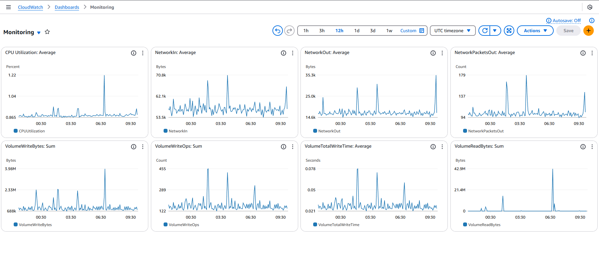
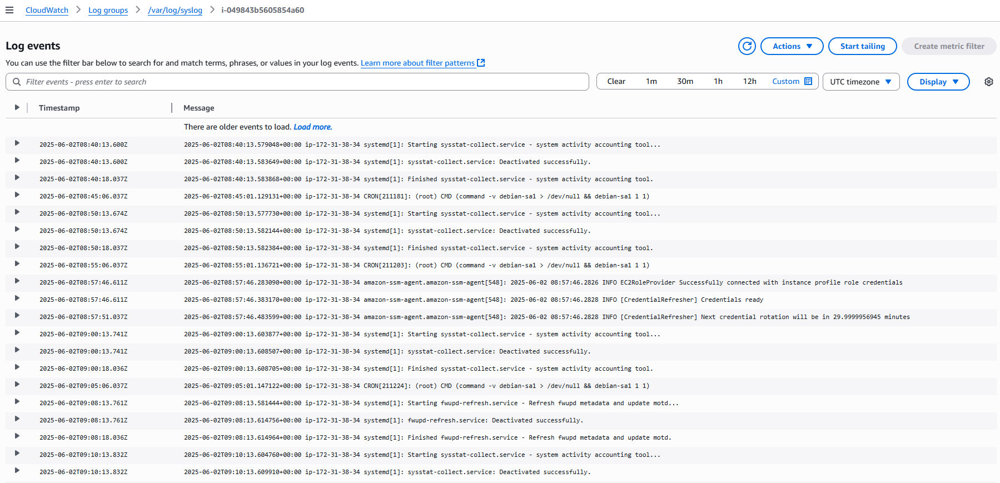
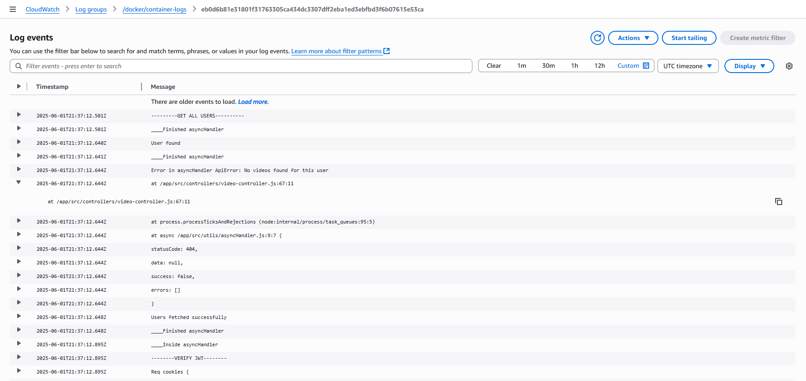

<h1>ClipSave Backend</h1>

<h3>A Video Management Platform for users to upload videos, and view other user's videos.</h3>

<h3>Users can</h3>

- Create account, profile & cover images.
- Login and logout with credentials.
- Update account, profile & cover images.
- Upload videos.
- Play videos and get views.
- Get their watch history.
- Subscribe to other users.

<i>
<u><h3>Express Backend</h3></u>

This repository is containerized with <b>Docker</b> and hosted on an <b>AWS EC2</b> Instance, with a CI/CD pipeline done with <b>Github Actions</b> - <a href="https://backend.clipsave.live">backend.clipsave.live</a>

<u><h3>React Frontend</h3></u>

The frontend is hosted live on Vercel on a different domain - <a href="https://clipsave.live/">clipsave.live</a>
<u><h3>MongoDB Database</h3></u>

<b>MongoDB</b> Atlas Driver is being used for connecting database.

<u><h3>REST API</h3></u>

The API is documented using Open API specifications with <b>Swagger API</b> - <a href="https://backend.clipsave.live/api-docs">API Documentation</a>

<u><h3>AWS Cloudwatch Monitoring & Logging </h3></u>

    
    
Monitoring

    
    
System Logs

    
    
Docker Logs

</i>

<h3>Dependencies</h3> 

<ul>
    <li>"axios" - For async communications</li>
    <li>"bcrypt" - For password hashing,</li>
    <li>"cloudinary" - For hosting media files,</li>
    <li>"cookie-parser" - For parsing cookies,</li>
    <li>"cors" - For allowing all origin requests,</li>
    <li>"dotenv" - To include .env variables in project,</li>
    <li>"express" - For web server,</li>
    <li>"jsonwebtoken" - To generate JW tokens,</li>
    <li>"mongodb" - To connect to MongoDB database,</li>
    <li>"mongoose" - MongoDB Modelling purpose,</li>
    <li>"multer" - Middleware used to store file in local environment,</li>
    <li>"swagger-ui-express" - To generate Swagger API page,</li>
    <li>"yamljs" - To parse yaml files</li>
</ul>

<i>

Postman Collection Included.

Swagger API Included.

</i>